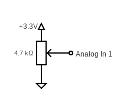

# notes-on-modular-things #

This work contains a (growing) collection of notes on the [Modular-Things](https://github.com/modular-things/modular-things) project.

## Background ##

"Hardware Computing" is exciting but requires knowledge and skills in

* Mechanics (and possibly case construction)
* Electronics and
* Programming

For mechanics, there are [fischertechnik](https://www.fischertechnik.de/en) and [Lego technic](https://www.lego.com/de-de/themes/technic/about), case construction is aided by 3D modelling tools and 3D printers, and programming is becoming easier for beginners thanks to [Blockly](https://developers.google.com/blockly), web-based development environments, or even generative AI.

However, electronics has remained difficult so far. Even modern microcontroller solutions like [Arduino](https://www.arduino.cc/) or [Espruino](https://www.espruino.com/) require (in addition to pure application development) at least the engagement with another environment - sometimes even the learning of another programming language.

[Modular Things](https://github.com/modular-things/modular-things) solve the problem by connecting prefabricated functional modules to a computer via USB, where they "register" along with their capabilities and can be controlled and linked together using JavaScript in a [web-based user interface](https://modular-things.com/), for example. The electronics side of hardware computing is thus reduced to simply wiring modules - on one side to a computer, and on the other side to sensors, actuators, and displays. The rest is just software.

And even if one has to assemble these modules (called "things") themselves (because they are currently not available for purchase), they can be easily recombined afterwards - making them ideal for learning, experimenting, prototyping and for demonstrators.

### Terminology ###

In the "Modular Things" terminology, a "**thing**" is a complete module consisting of some hardware (e.g., an RP2040 board with any additional electronics required) and some software which lets the microcontroler communicate with a PC over USB and advertise itself and its functionalities in the modular-things web-based IDE.

The "**firmware**" of a thing is an Arduino sketch which implements a thing's functionality on the hardware side, and the "**software**" of a thing is  its JavaScript interface (which may still include some additional functionality on the software side)

## Hardware Requirements ##

In this work, the base of every module is a breakout board for the [Raspberry Pi Pico RP2040](https://www.raspberrypi.com/documentation/microcontrollers/pico-series.html#rp2040) microcontroller - usually a [Waveshare RP2040-Zero](https://www.waveshare.com/wiki/RP2040-Zero) (because that seems to be the cheapest one - at least, here in Germany). However, many other modules (e.g., the [Pimoroni Tiny2040](https://shop.pimoroni.com/products/tiny-2040)) may be used as well - sometimes after slightly modifying the Arduino sketch that is required for the "firmware" of a "thing".

(t.b.w)

## Installation and Usage ##

Let's say, you have chosen a "thing" that you plan to build - or you want to develop a new one. Assuming, that this thing is called "xxx" (the name should qualify as a valid Javascript identifier), then you will find below the instructions for installation and use of that thing (skip whatever does not seem applicable and change `xxx` to the actual name of your thing):

#### Firmware Preparation ####

1. Install Arduino IDE (see https://www.arduino.cc/en/software)
2. Install the board "**Raspberry Pi Pico/RP2040/RP2350** by Earle F. Philhower, III" using the Arduino "Boards Manager"
3. Install "**osap** by Jake Robert Read" using the Arduino "Library Manager"

#### Firmware Installation ####

1. Create a new sketch and rename it to `xxx`
2. Copy the firmware for your thing from the internet into the sketch editor (or develop your own)
3. Connect the RP2040 board via USB and select it from the board dropdown in the Arduino IDE
4. Compile and upload the sketch

#### Software Preparation ####

1. Install Node.js (see https://nodejs.org/en/)
2. Download "modular-things" as a [ZIP archive](https://github.com/modular-things/modular-things/archive/refs/heads/main.zip), unpack it, and move it to a location of your choice
3. Open a terminal window and navigate to the extracted directory
4. run `npm install`

#### Software Installation ####

1. Open the terminal window and navigate to the extracted directory
2. copy the "xxx" directory from this repository and its contents into the `./things` folder. In the end, `./things/xxx` should have the following structure:
```
./things/xxx/
  circuit/
    images/
      layout.png
      schematic.png
      preview.png
  firmware/
    xxx/
      xxx.ino
  software/
    xxx.ts
```
3. Insert the following text into file `./things/_things.json` after the first line (i.e., after the opening bracket):
```json
  {
    "author":  "your name",
    "name":    "xxx",
    "software":"software/xxx.ts",
    "firmware":"firmware/xxx/xxx.ino",
    "images": [
      { 
        "name": "layout", 
        "src": "circuit/images/layout.png"
      },
      { 
        "name": "schematic", 
        "src": "circuit/images/schematic.png"
      },
      { 
        "name": "preview", 
        "src": "circuit/images/preview.png"
      }
    ]
  },
```
4. Insert the following lines into file `./index.ts`
  * `import xxx from "./xxx/software/xxx";`<br>e.g., as the last import statement
  * `xxx,`<br>e.g., as the last line in the `export default {` block
5. (Re)start the server<br>
    `npm run dev`

#### Thing Usage ####

1. Connect the properly prepared RP2040 board to your computer via USB.
2. Open the (**custom**) web environment: [http://localhost:3000](http://localhost:3000)
3. Click on "pair new thing" and select the "thing" you connected before<br>(the "List of Things" should now display a description of its interface).
4. Click on "rename" and change the name of your thing to something you want to use in your application (the new name must be a valid JavaScript variable identifier).

You should now be able to access your thing using JavaScript from within the IDE.

## How to develop your own "Thing" ##

Thanks to the design of "modular things", it turns out to be pretty simple to develop custom "things" - you do not even have to really know the Arduino environment and its C dialect. In many cases it is sufficient to use the templates shown below and fill in the "Building Blocks" for the desired functionality - that's it. The hardware may then be built using a breadboard.

### Templates ###

The following sections contain templates for the most important files that make up a "thing" - with placeholders where you should fill in the actual code for the functionalities you need. That code may either be found further below (in chapter "Building Blocks") or you will have to develop it yourself.

After completing these files, you should copy them into your thing's directory within your server's `./things` folder (as already described above):

```
./things/
  _things.json
  index.ts
  xxx/
    circuit/
      images/
        layout.png
        schematic.png
        preview.png
    firmware/
      xxx/
        xxx.ino
    software/
      xxx.ts
```

#### _things.json ####

`_things.json` is the file where you tell the server your thing's name and where to find all files that make up that thing.

Insert the following lines to that file (usually at the second line):

```json
  {
    "author":  "your name",
    "name":    "xxx",
    "software":"software/xxx.ts",
    "firmware":"firmware/xxx/xxx.ino",
    "images": [
      {
        "name": "layout",
        "src": "circuit/images/layout.png"
      },
      {
        "name": "schematic",
        "src": "circuit/images/schematic.png"
      },
      {
        "name": "preview",
        "src": "circuit/images/preview.png"
      }
    ]
  },
```

#### index.ts ####

`index.ts` is used by the web IDE to load your thing's JavaScript interface.

You will have to apply two changes:

1. add line `import xxx from "./xxx/software/xxx";` e.g., as the last import statement
2. add line `xxx,` e.g., as the last line in the `export default {` block

#### xxx.ino ####

`xxx.ino` is an arduino "sketch" implementing the communication between the RP2040 and your PC over USB and the actual functionality of your "thing"

Use the following template as a basis for your development:

```c++
#include <osap.h>
<<<< add more includes here, if necessary

  OSAP_Runtime osap;
  OSAP_Gateway_USBSerial serLink(&Serial);
  OSAP_Port_DeviceNames namePort("xxx");  <<<< don't forget to insert your thing's name here

<<<< add any required definitions and functions for your thing

/**** Startup ****/

  void setup() {
    osap.begin();

<<<< add any required initialization code here
  }

/**** Operation ****/

  void loop() {
    osap.loop();

<<<< add any required operation code here
  }
```

#### xxx.ts ####

`xxx.ts` (or `xxx.js`) implements the JavaScript interface of your thing. 

Use the following template as a basis for your development:

```typescript
import Thing from "../../../src/lib/thing"

export default class xxx extends Thing {  <<<< don't forget to insert your thing's name here
<<<< add any required methods here

/**** API Specification ****/

  public api = [
<<<< add the interface documentation here
  ]
}
```

## Building Blocks ##

The following sections contain code for various functionalities that can be inserted into the templates shown above. In many cases, multiple functionalites can be combined into a single "thing", if you adjust the configured interface pins according to the capabilities of your RP2040 board.

### Built-in RGB LEDs ###

Both the [Pimoroni Tiny2040](https://shop.pimoroni.com/products/tiny-2040) and the [Waveshare RP2040-Zero](https://www.waveshare.com/wiki/RP2040-Zero) have an RGB LED built-in. As it is always present, there is no reason why it should not be made accessible - e.g., it could be used to indicate successful operation or any errors that occurred.

Here are the **building blocks for the Pimoroni board firmware** (the "software" part is board-independent):

* **`xxx.ino` functions and definitions**
```c++
#define PIN_LED_R 18
#define PIN_LED_G 19
#define PIN_LED_B 20

/**** RGB Control (RGB LED on Tiny2040 is "active low"!) ****/

  void _setRGB (uint8_t* Data, size_t Length) {
    analogWrite(PIN_LED_R, 65535-(Length < 2 ? 0 : Data[0] + Data[1]*255));
    analogWrite(PIN_LED_G, 65535-(Length < 4 ? 0 : Data[2] + Data[3]*255));
    analogWrite(PIN_LED_B, 65535-(Length < 6 ? 0 : Data[4] + Data[5]*255));
  }
  OSAP_Port_Named setRGB("setRGB",_setRGB);
```
* **`xxx.ino` setup**
```c++
    analogWriteResolution(16);             // according to RP2040 specifications

    pinMode(PIN_LED_R,OUTPUT);
    pinMode(PIN_LED_G,OUTPUT);
    pinMode(PIN_LED_B,OUTPUT);

    analogWrite(PIN_LED_R,65535);              // initially switches the LED off
    analogWrite(PIN_LED_G,65535);                                        // dto.
    analogWrite(PIN_LED_B,65535);                                        // dto.
```

And here are the **building blocks for the Waveshare board firmware** (the "software" part is board-independent):

* **`xxx.ino` includes**
```c++
#include <Adafruit_NeoPixel.h>
```
* **`xxx.ino` functions and definitions**
```c++
#define builtin_LED_Pin 16

/**** RGB Control ****/

  Adafruit_NeoPixel builtin_LED(1, builtin_LED_Pin, NEO_GRB + NEO_KHZ800);

  void _setRGB (uint8_t* Data, size_t Length) {
    int R = (Length < 2 ? 0 : Data[1]);
    int G = (Length < 4 ? 0 : Data[3]);
    int B = (Length < 6 ? 0 : Data[5]);

    builtin_LED.setPixelColor(0,builtin_LED.Color(R,G,B));
    builtin_LED.show();
  }
  OSAP_Port_Named setRGB("setRGB",_setRGB);
```
* **`xxx.ino` setup**
```c++
    builtin_LED.begin();
    builtin_LED.setPixelColor(0,builtin_LED.Color(0,16,0));
    builtin_LED.show();
```
> Nota bene: some Waveshare boards seem to have a WS2812 RGB LED with byte order `NEO_RGB`. If you think that your on-board LED shows the wrong colors, you may try to replace the byte order `NEO_GRB` shown above with `NEO_RGB`

Here is the **board-independent software part**:

* **`xxx.ts` methods**
```typescript
  async setRGB (R:number, G:number, B:number):Promise<void> {
    const Datagram = new Uint8Array([
      255 * Math.max(0,Math.min(R,1)),
      255 * Math.max(0,Math.min(G,1)),
      255 * Math.max(0,Math.min(B,1)),
    ])
    await this.send('setRGB',Datagram)
  }
```
* **`xxx.ts` API documentation**
```typescript
  {
    name: 'setRGB',
    args: [
      'R: 0 to 1',
      'G: 0 to 1',
      'B: 0 to 1'
    ]
  },
```

**Usage**:

Assuming, that your (paired) "thing" is called `Thing`, using the built-in RGB LED is simple:

```javascript
  await Thing.setRGB(0,0.1,0) // let's the LED glow green
```

### Digital Inputs ###

This section describes the implementation of digital inputs which return `true` or `false` on the JavaScript side. When using some electronics to drive an input pin, **keep in mind that the RP2040 accepts input voltages up to 3.3V only!** The example uses pins 0...3 for that purpose, but you may easily change that if you modify the code accordingly.

> in order to produce stable values, the input pins of the RP2040 will be configured with a pull-up resistor. By default (i.e., when left unconnected), such a pin will be HIGH and has to be connected to GND in order to become LOW - this behaviour is called "active-low" and your electronics should take care of that. However, in order not to confuse JavaScript users, the "firmware" will invert the input states and simulate digital inputs which are "active-high", where `false` means "off" and `true` means "on"

Here are the **building blocks for the firmware**:

* **`xxx.ino` functions and definitions**
```c++
/**** Digital Input ("active low" because of pull-up resistor) ****/

  int DigitalIn[4] = { 0,1,2,3 };

  size_t _getDigital (uint8_t* Data, size_t Length, uint8_t* Response) {
    if (Length > 0) {
      int Port = Data[0];
      if ((Port >= 0) && (Port <= 3)) {
        int Value = digitalRead(DigitalIn[Port]);
          Response[0] = (Value == LOW ? 1 : 0);                      // no typo!
        return 1;     // when connected to GND, _getDigital sends 1, otherwise 0
      }
    }
    return 0;
  }
  OSAP_Port_Named getDigital("getDigital",_getDigital);
```
* **`xxx.ino` setup**
```c++
    for (int Port = 0; Port < 4; Port++) {
      pinMode (DigitalIn[Port],INPUT_PULLUP);    // for a well-defined potential
    }
```

And here is the **software part**:

* **`xxx.ts` methods**
```typescript
/**** Digital Input ****/

  async getDigital (Port:number):Promise<boolean> {
    Port = Math.floor(Port)
    if ((Port < 0) || (Port > 3)) throw new Error(
      'invalid digital input port ' + Port
    )

    const Data = await this.send('getDigital',new Uint8Array([Port]))
    return (Data[0] > 0)
  }
```
* **`xxx.ts` API documentation**
```typescript
  {
    name:  'getDigital',
    args:  [ 'port: 0 to 3' ],
    return:'true or false'
  },
```

**Usage**:

Assuming, that your (paired) "thing" is called `Thing`, the following code can be used to read the state of a given digital input:


```javascript
  const State = await Thing.getDigital(0) // reads from input #0
  console.log(State == false ? 'off' : 'on')
```

### Digital Outputs ###

This section describes the implementation of digital outputs: setting their JavaScript representation to `true` will set the level of an output pin to HIGH and `false` will set it to LOW. The example uses pins 4...7 for that purpose, but you may easily change that if you modify the code accordingly.

Here are the **building blocks for the firmware**:

* **`xxx.ino` functions and definitions**
```c++
/**** Digital Output ****/

  int DigitalOut[4] = { 4,5,6,7 };

  void _setDigital (uint8_t* Data, size_t Length) {
    if (Length > 0) {
      int Port = Data[0];
      if ((Port >= 0) && (Port <= 3)) {
        digitalWrite(DigitalOut[Port], (Length == 1) || (Data[1] == 0) ? LOW : HIGH);
      }
    }
  }
  OSAP_Port_Named setDigital("setDigital",_setDigital);
```
* **`xxx.ino` setup**
```c++
    for (int Port = 0; Port < 4; Port++) {
      pinMode(DigitalOut[Port],OUTPUT);
    }
```

And here is the **software counterpart**:

* **`xxx.ts` methods**
```typescript
/**** Digital Output ****/

  async setDigital (Port:number, Value:boolean):Promise<void> {
    Port = Math.floor(Port)
    if ((Port < 0) || (Port > 3)) throw new Error(
      'invalid digital output port ' + Port
    )

    const Datagram = new Uint8Array([Port,Value ? 255 : 0])
    await this.send('setDigital',Datagram)
  }
```
* **`xxx.ts` API documentation**
```typescript
  {
    name: 'setDigital',
    args: [ 'port: 0 to 3', 'value: true or false' ]
  },
```

**Usage**:

Assuming, that your (paired) "thing" is called `Thing`, the following code can be used to set the state of a given digital output (the example uses the output to drive a LED. The value of resistor R therefore depends on the type of LED you plan to use - and **keep in mind that the output voltage of a digital pin is 3.3V**):


```javascript
  await Thing.setDigital(0,true) // switches output #0 on
```

### Analog Inputs ###

This section describes the implementation of analog inputs which return a value ranging from 0 to 1 on the JavaScript side (independent of the actual ADC resolution, which is set to the maximum possible). When using some electronics to drive an input pin, **keep in mind that the RP2040 accepts input voltages up to 3.3V only!** The example uses pins 26 and 27 for that purpose, but you may easily change that if you modify the code accordingly.

Here are the **building blocks for the firmware**:

* **`xxx.ino` functions and definitions**
```c++
/**** Analog Input ****/

  int AnalogIn[2] = { 26,27 };

  size_t _getAnalog (uint8_t* Data, size_t Length, uint8_t* Response) {
    if (Length > 0) {
      int Port = Data[0];
      if ((Port >= 0) && (Port <= 1)) {
        uint16_t Value = analogRead(AnalogIn[Port]);
          Response[0] = Value & 0xFF;
          Response[1] = Value >> 8 & 0xFF;
        return 2;
      }
    }
    return 0;
  }
  OSAP_Port_Named getAnalog("getAnalog",_getAnalog);
```
* **`xxx.ino` setup**
```c++
    analogReadResolution(12);              // according to RP2040 specifications

    for (int Port = 0; Port < 2; Port++) {
      analogRead(AnalogIn[Port]);
    }
```

And here is the **software counterpart**:

* **`xxx.ts` methods**
```typescript
/**** Analog Input ****/

  async getAnalog (Port:number):Promise<number> {
    Port = Math.floor(Port)
    if ((Port < 0) || (Port > 1)) throw new Error(
      'invalid analog input port ' + Port
    )

    const Data = await this.send('getAnalog',new Uint8Array([Port]))
    return (Data[0] + Data[1]*255) / 4096
  }
```
* **`xxx.ts` API documentation**
```typescript
  {
    name:  'getAnalog',
    args:  [ 'port: 0 to 1' ],
    return:'0 to 1'
  },
```

**Usage**:

Assuming, that your (paired) "thing" is called `Thing`, the following code can be used to read the value of a given analog input:



```javascript
  const Value = await Thing.getAnalog(0) // reads from input #0
  console.log(Value)
```

### Analog Outputs ###

This section describes the implementation of (pseudo) analog outputs: setting their JavaScript representation to a value ranging from 0 to 1 will produce a PWM signal with a duty cycle of that value. The example uses pins 28 and 29 for that purpose, but you may easily change that if you modify the code accordingly.

Here are the **building blocks for the firmware**:

* **`xxx.ino` functions and definitions**
```c++
/**** Analog Output ****/

  int AnalogOut[2] = { 28,29 };

  void _setAnalog (uint8_t* Data, size_t Length) {
    if (Length > 0) {
      int Port = Data[0];
      if ((Port >= 0) && (Port <= 1)) {
        analogWrite(AnalogOut[Port], (Length < 2 ? 0 : Data[1] + Data[2]*255));
      }
    }
  }
  OSAP_Port_Named setAnalog("setAnalog",_setAnalog);
```
* **`xxx.ino` setup**
```c++
    analogWriteResolution(16);             // according to RP2040 specifications
    for (int Port = 0; Port < 4; Port++) {
      pinMode(AnalogOut[Port],OUTPUT);
      analogWrite(AnalogOut[Port],0);
    }
```

And here is the **software counterpart**:

* **`xxx.ts` methods**
```typescript
/**** Analog Output ****/

  async setAnalog (Port:number, Value:number):Promise<void> {
    Port = Math.floor(Port)
    if ((Port < 0) || (Port > 1)) throw new Error(
      'multi-io thing: invalid analog output port ' + Port
    )

    Value = Math.floor(4096 * Math.max(0,Math.min(Value,1)))
    await this.send('setAnalog',new Uint8Array([
      Port, Value & 0xFF, Value >> 8 & 0xFF
    ]))
  }
```
* **`xxx.ts` API documentation**
```typescript
  {
    name:  'setAnalog',
    args:  [ 'port: 0 to 1', 'value: 0 to 1' ]
  },
```

**Usage**:

Assuming, that your (paired) "thing" is called `Thing`, the following code can be used to set the duty cycle of a given analog output (the example uses the output to drive a LED. The value of resistor R therefore depends on the type of LED you plan to use - and **keep in mind that the output voltage of a digital pin is 3.3V**):


```javascript
  Thing.setAnalog(0,0.1)
```

### RC Servo Control ###

(t.b.w)

### Continuous Rotation RC Servo Control ###

(t.b.w)

### NeoPixel (WS2812) Control ###

(t.b.w)

## Application Examples ##

(t.b.w)

## License ##

[MIT License](LICENSE.md)
